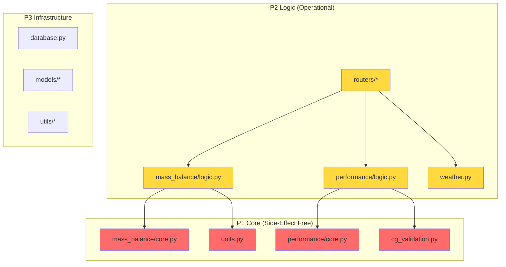

# Architecture Documentation

## System Overview

The Aviation Performance Tool is a safety-critical web application for General Aviation pilots to calculate Mass & Balance, Takeoff/Landing Performance, and Fuel Endurance.

```
┌─────────────────────────────────────────────────────────────────┐
│                        Frontend (Vue 3)                         │
│  ┌──────────────┐  ┌──────────────┐  ┌──────────────────────┐  │
│  │  M&B Module  │  │ Performance  │  │   Aircraft Manager   │  │
│  │              │  │   Module     │  │                      │  │
│  └──────────────┘  └──────────────┘  └──────────────────────┘  │
└─────────────────────────────┬───────────────────────────────────┘
                              │ REST API
┌─────────────────────────────┴───────────────────────────────────┐
│                      Backend (FastAPI)                          │
│  ┌──────────────────────────────────────────────────────────┐  │
│  │                    API Layer (P2)                         │  │
│  │   /api/v1/aircraft  /api/v1/calculate  /api/v1/weather   │  │
│  └──────────────────────────────────────────────────────────┘  │
│  ┌──────────────────────────────────────────────────────────┐  │
│  │                   Service Layer                           │  │
│  │  ┌─────────────────────────────────────────────────────┐ │  │
│  │  │ P1 Core (Safety-Critical, Side-Effect Free)         │ │  │
│  │  │  • mass_balance/core.py  • performance/core.py     │ │  │
│  │  │  • units.py              • cg_validation.py        │ │  │
│  │  └─────────────────────────────────────────────────────┘ │  │
│  │  ┌─────────────────────────────────────────────────────┐ │  │
│  │  │ P2 Logic (Operational)                              │ │  │
│  │  │  • mass_balance/logic.py  • performance/logic.py   │ │  │
│  │  │  • weather.py                                       │ │  │
│  │  └─────────────────────────────────────────────────────┘ │  │
│  └──────────────────────────────────────────────────────────┘  │
│  ┌──────────────────────────────────────────────────────────┐  │
│  │                    Data Layer (P3)                        │  │
│  │       Aircraft Profiles (JSON) │ Airport Database         │  │
│  └──────────────────────────────────────────────────────────┘  │
└─────────────────────────────────────────────────────────────────┘
```

---

## Priority Architecture (REQ-SYS-03)

The codebase enforces a **3-Tier Priority System** aligned with the [Priority Definitions](../requirements/initial_requirements.md):

| Priority | Classification | Coverage Target | Description |
|----------|----------------|-----------------|-------------|
| **P1** | Critical/Safety | $90\%$ | Essential for flight-safe calculations. Side-effect free. |
| **P2** | Operational/Efficiency | $80\%$ | Significant value/error reduction in cockpit. |
| **P3** | Comfort/Future | $70\%$ | Facilitates documentation or administration. |

### Core vs. Logic Split

Each service module is split into two files:

| File | Priority | Architectural Constraint |
|------|----------|--------------------------|
| `core.py` | **P1** | **Must be side-effect free**: pure functions, no I/O, no database, no external APIs, no mutable global state. |
| `logic.py` | **P2** | May perform I/O, orchestrate workflows, and integrate with external services. |



### Dependency Direction Rules

> [!CAUTION]
> **P1 modules SHALL NOT import from P2 or P3 modules.** This isolation ensures safety-critical calculations cannot be influenced by operational or comfort code.

| Source Module | May Import From |
|---------------|-----------------|
| P1 (`core.py`, `units.py`, `cg_validation.py`) | Standard library, approved external packages only |
| P2 (`logic.py`, `weather.py`, `routers/`) | P1 modules, P3 infrastructure |
| P3 (`models/`, `utils/`, `database.py`) | P1 modules, P2 modules |

This is enforced by `import-linter` in CI. See [.importlinter](../../.importlinter) for configuration.

---

## Directory Structure to Priority Mapping

```
backend/app/
├── routers/                    # P2 (Operational)
│   ├── aircraft.py
│   ├── calculations.py
│   ├── health.py
│   └── weather.py
├── services/
│   ├── mass_balance/
│   │   ├── core.py            # P1 (Safety-Critical)
│   │   └── logic.py           # P2 (Operational)
│   ├── performance/
│   │   ├── core.py            # P1 (Safety-Critical)
│   │   └── logic.py           # P2 (Operational)
│   ├── units.py               # P1 (Safety-Critical) - REQ-SYS-03
│   ├── cg_validation.py       # P1 (Safety-Critical) - REQ-MB-06
│   └── weather.py             # P2 (Operational) - REQ-WX-01
├── models/                     # P3 (Infrastructure)
├── schemas/                    # P3 (Infrastructure)
└── utils/                      # P3 (Infrastructure)
```

---

## Technology Stack

| Layer | Technology | Rationale |
|-------|------------|-----------|
| Frontend | Vue 3 + TypeScript | Reactive UI, strong typing |
| Styling | CSS (Vanilla) | Maximum control, no framework lock-in |
| Backend | FastAPI (Python) | Fast, async, auto-generated OpenAPI docs |
| Database | JSON Files (local) | Offline-first, portable profiles (REQ-SYS-01) |
| Package Manager | uv (Python), npm (Node) | Fast, reliable dependency management |
| Containerization | Docker | Consistent deployment |

---

## Module Architecture

### 1. Mass & Balance Core (`services/mass_balance/core.py`)

**Priority**: P1 (Safety-Critical)  
**Constraint**: Side-effect free

**Key Functions**:
```python
def calculate_total_moment(stations: list[LoadStation]) -> KilogramMeter:
    """Pure calculation of total moment. REQ-MB-01."""

def calculate_cg_position(
    total_mass: Kilogram, 
    total_moment: KilogramMeter
) -> Meter:
    """Pure CG position calculation. REQ-MB-01."""
```

**Requirements Implemented**: REQ-MB-01, REQ-MB-07, REQ-MB-11

---

### 2. Performance Core (`services/performance/core.py`)

**Priority**: P1 (Safety-Critical)  
**Constraint**: Side-effect free

**Key Functions**:
```python
def calculate_density_altitude(
    elevation_ft: Feet,
    qnh_hpa: float,
    temperature_c: float
) -> Feet:
    """Pure density altitude calculation. REQ-PF-05."""

def calculate_pressure_altitude(
    elevation_ft: Feet,
    qnh_hpa: float
) -> Feet:
    """PA = Elevation + (1013.25 - QNH) × 30. REQ-PF-16."""
```

**Requirements Implemented**: REQ-PF-01, REQ-PF-05, REQ-PF-12, REQ-PF-16, REQ-PF-23

---

### 3. Unit Conversion (`services/units.py`)

**Priority**: P1 (Safety-Critical)  
**Constraint**: Side-effect free

Prevents unit confusion through branded types (H-01 mitigation).

```python
class Kilogram(float): """Mass in kilograms."""
class Pound(float): """Mass in pounds."""
class Liter(float): """Volume in liters."""
class Gallon(float): """Volume in US gallons."""
class Meter(float): """Length in meters."""
class Feet(float): """Length in feet."""
```

**Requirements Implemented**: REQ-SYS-03, REQ-UQ-04, REQ-AC-13

---

### 4. CG Validation (`services/cg_validation.py`)

**Priority**: P1 (Safety-Critical)  
**Constraint**: Side-effect free

**Algorithm**: Point-in-Polygon (Ray Casting) for polygonal envelopes.

```python
def is_within_envelope(
    cg: CGPoint,
    envelope: list[EnvelopeVertex]
) -> bool:
    """
    Uses ray casting algorithm for polygon containment.
    Supports non-linear, sloped envelopes (REQ-MB-06).
    """
```

**Requirements Implemented**: REQ-MB-06, REQ-MB-10

---

## Safety Architecture

### Hazard Mitigation Layers

```
Layer 1: Input Validation (REQ-UI-11)
         ↓ Invalid inputs rejected
Layer 2: Type Safety (Branded Units - H-01 mitigation)
         ↓ Unit confusion prevented
Layer 3: Calculation Guards (REQ-PF-13, REQ-PF-17)
         ↓ Extrapolation controlled
Layer 4: Result Validation (REQ-MB-03, REQ-MB-04, REQ-PF-09)
         ↓ Limit violations detected
Layer 5: Visual Feedback (REQ-UI-10)
         ↓ Pilot informed
Layer 6: Audit Trail (Logging)
         ↓ Decisions recorded
```

### Error Handling Strategy

| Error Type | Handling | User Impact |
|------------|----------|-------------|
| Input Validation | Reject immediately | Red border, error message |
| Calculation Error | Raise exception, log | "Unable to calculate" message |
| Limit Violation | Return result + warning | Yellow/Red visual indicator |
| System Error | Log, graceful degradation | Error page with recovery options |

---

## Deployment Architecture

```
┌─────────────────────────────────────────────┐
│              Docker Compose                  │
│  ┌─────────────────┐  ┌─────────────────┐  │
│  │    Frontend     │  │     Backend     │  │
│  │   (nginx:80)    │  │  (uvicorn:8000) │  │
│  └────────┬────────┘  └────────┬────────┘  │
│           │                    │            │
│           └────────┬───────────┘            │
│                    │                        │
│           ┌────────┴────────┐               │
│           │  Shared Volume  │               │
│           │   (data/)       │               │
│           └─────────────────┘               │
└─────────────────────────────────────────────┘
```

---

> Document Version: 1.0.0  
> Last Updated: 2026-02-03
